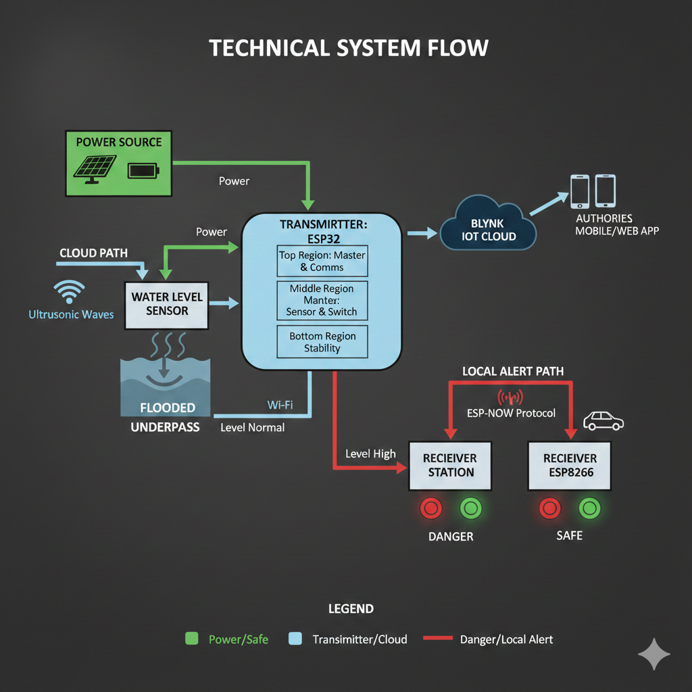

  

# Water Level Monitoring and Alert System 

This project presents a smart, IoT-based water level detection and monitoring system designed to mitigate urban waterlogging issues, particularly in flood-prone zones like tunnels and underpasses. It provides real-time alerts to drivers and authorities to prevent vehicle damage, traffic congestion, and accidents.

> [!IMPORTANT]
>**Project Achievement:** Selected Under the **MSME Idea Hackathon 4.0** by the Ministry of MSME, Government of India.

---

## 🚀 Features
* **Real-Time Monitoring:** Continuous water level detection using advanced waterproof ultrasonic sensors.
* **Dual Alert System:** Local visual indicators (Red/Green LEDs) for drivers and a remote cloud-based dashboard for authorities.
* **Wireless Communication:** Utilizes the **ESP-NOW** protocol for reliable, low-latency communication between the transmitter and receivers.
* **Self-Sustaining Power:** Solar-powered setup with integrated battery backup ensures operation during storms or blackouts.
* **Cloud Integration:** Real-time data synchronization with the **Blynk IoT Platform** for remote access and historical data viewing.

---

## 🏗️ System Architecture
The system is divided into two primary sections to ensure comprehensive coverage:

### 1. Transmitter Station 
The transmitter is built with a **three-part cylindrical tubular structure**:
* **Top Region:** Houses the ESP32 (Master controller), wireless modules, and power circuitry.
* **Middle Region:** A slitted hollow pipe allowing water entry; contains the waterproof ultrasonic sensor and a magnetic switch.
* **Bottom Region:** Buried underground to provide structural stability to the monitoring pole.

### 2. Receiver Section 
Deployed at tunnel entrances to warn approaching traffic before they enter flood zones:
* **Control:** Managed by ESP8266 modules receiving wireless commands via ESP-NOW.
* **Visuals:** High-visibility Red (Danger) and Green (Safe) indicators designed for simple interpretation by laypeople.

---

## 📋 Technical Flow Diagram
The following diagram illustrates how data flows from the environment to the local indicators and the cloud dashboard.

## 📺 Project Demo
   
---

## 🛠️ Components List
| Component | Description |
| :--- | :--- |
| **ESP32 Dev Kit** | Main Microcontroller for the Transmitter station  |
| **ESP8266 Modules** | Microcontrollers used in the Receiver stations  |
| **Waterproof Ultrasonic Sensor** | Precision water level detector  |
| **Solar Panel** | Renewable power supply  |
| **Battery Backup** | Energy storage for continuous operation  |
| **Blynk IoT Platform** | Cloud dashboard and mobile interface  |

---

## 💻 Software Implementation

### Communication Logic (ESP-NOW)
The system uses the ESP-NOW protocol to send water level status from the transmitter to the receivers without requiring a local Wi-Fi router.
* **Safe State:** If the water level is below the pre-defined threshold, the Green LED is activated.
* **Danger State:** When water exceeds the threshold (e.g., $50\text{ cm}$), the system sends an ON command to the Red LED.

### Cloud Integration (Blynk)
The ESP32 connects to Wi-Fi to update the Blynk dashboard in real-time:
* **Virtual Pin V0:** Displays real-time distance and water level readings.
* **Virtual Pin V1:** Allows for manual or automatic relay control for secondary response systems.

---

## 🔧 Installation & Deployment
The system is designed for rapid deployment in urban or rural environments:
1.  **Mounting:** Install the transmitter pole in the lowest-lying area of the tunnel or underpass.
2.  **Indicators:** Place at least two receiver stations at the ends of the tunnel for incoming traffic.
3.  **Connectivity:** Configure the unique MAC address of the ESP8266 receivers in the ESP32 transmitter code to establish the ESP-NOW link.
4.  **Blynk Setup:** Input your Auth Token and Wi-Fi credentials into the code to enable remote monitoring.

---

## 👥 Project Team
* **Authors:** Pratik Tiwari, Vedant Kakde, Dhanshree Nagpure, Pushpak Deulkar.
* **Institute:** St. Vincent Pallotti College of Engineering and Technology, Nagpur.
* **Project Duration:** 2023–2024.
